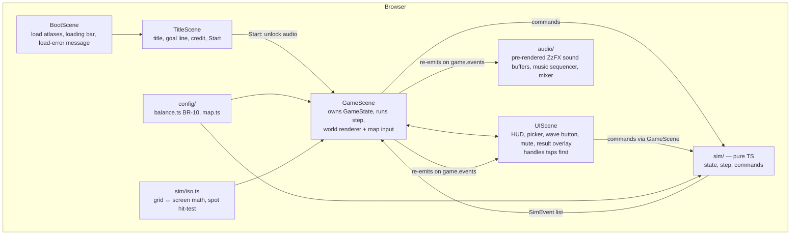

# Technical Design — Tower Defense Project (Game Jam Entry)

| Field | Value |
|---|---|
| Requirements | docs/02-requirements/requirements.md (v0.3, approved 2026-10-04) |
| Tech Lead | Pino |
| Status | In review (v0.2 — design-review findings applied) |

## 1. Overview
A static, client-only browser game: **Vite + TypeScript + Phaser 3** (ADR-001). All game rules live in a **pure TypeScript simulation** with no Phaser imports, stepped at a fixed 60 Hz (ADR-002). This makes the rules unit-testable and lets a headless test play a full run to check balance and timing (AC-6.6). Phaser only draws the simulation's state and turns clicks and taps into commands. All sound is synthesized with the **Web Audio API**, using ZzFX for sound effects and a small custom sequencer for music (ADR-003). The output is a `dist/` folder of static files that runs locally with `npm run dev` / `npm run preview`, and later on Vercel with no configuration.

## 2. Current state
Greenfield. The repo holds only the SDLC docs, `CLAUDE.md` and `assets/kenney_tower-defense/` (CC0):
- `Spritesheet/landscape_sheet.png` + `.xml` (2048×512, 64 frames, 281 KB). Most tiles are **132×99 px**: the top face is a 2:1 diamond of **132×66**, with a 33 px side below it. Some frames are 83 or 115 px tall (raised or lowered tiles), so sprites are anchored by their **bottom**, not their top (§3.5).
- `Spritesheet/towers_{grey,red,brown}_sheet.png` + `.xml` (1024×512, 55 stackable pieces each, ≈ 120 KB each).
- The XML is Starling/Sparrow `TextureAtlas` format, which Phaser loads directly with `load.atlasXML`.

Node 24.15 and npm 11.12 are installed. No standing rules exist in `CLAUDE.md` yet.

## 3. Proposed design

### 3.1 Components


**Source layout** (created during Build, after Planning is approved):

| Path | Responsibility |
|---|---|
| `index.html`, `src/main.ts` | Phaser config: `Scale.RESIZE`, `audio: { noAudio: true }` (we run our own AudioContext), parent div, scene list. Mobile meta tags and CSS (`touch-action:none` on html, body and canvas; `user-select:none`; `100dvh`; no page scroll; `preventDefault` on `gesturestart`). |
| `src/config/balance.ts` | Every BR-10 number (towers, enemies, waves, start lives and gold, projectile speeds). The single place to tune values. |
| `src/config/map.ts` | 8×8 tile grid (frame name per cell), path waypoints (grid coordinates, ~24 tiles), 10 build spots, scenery placements. |
| `src/sim/iso.ts` | Pure geometry: `gridToWorld`, `worldToGrid`, `nearestSpot(worldPt, spots, maxDist)`, which returns the nearest spot of **any** state. The caller rejects occupied spots. Tile step: 66 px across and 33 px down per grid step. |
| `src/sim/state.ts` | `GameState` types and `createRun()`. |
| `src/sim/step.ts` | `step(state, dt) → SimEvent[]`: spawning, movement, targeting, firing, projectiles, damage, wave end, win/lose. |
| `src/sim/commands.ts` | `startRun`, `build(spotId, type)`, `startWave()`. Each validates and returns ok or a reason. |
| `src/audio/` | `audio.ts` (AudioContext, unlock, master gain, mute, tab-hidden suspend, at most 4 copies of a sound), `sfx.ts` (ZzFX presets per event), `music.ts` (looping chiptune step sequencer). |
| `src/scenes/` | `BootScene`, `TitleScene`, `GameScene`, `UIScene`. |
| `src/render/` | `enemies.ts` (Grunt, Runner and Brute drawn as Phaser Graphics, cached to textures), `effects.ts` (explosion, death puff, floating text, lives flash), `palette.ts` (colours sampled from the Kenney sheets). |
| `public/assets/` | Copies of the needed sheets: landscape, grey (Archer), red (Cannon). |
| `tests/` | Vitest: `iso.test.ts`, `commands.test.ts`, `step.test.ts`, `balance.test.ts` (headless full run). |

**Towers:** each tower is a Phaser `Container` of 2–3 stacked Kenney tower pieces (base, then middle and top) at one spot. The container gets one depth, so the pieces always draw in the right order. The grey sheet is used for the Archer and the red sheet for the Cannon. Frame names are picked from the atlas during Build and kept as constants in `map.ts`.

**Build spots (AC-2.3):** each empty spot is drawn with a Kenney tile in a different colour from plain grass, plus a code-drawn light diamond outline that pulses gently. The outline disappears once a tower is built.

**Ownership:** GameScene owns the `GameState`. It runs `step()`, applies commands (UIScene calls `gameScene.command(...)`) and re-emits each `SimEvent` on `game.events`. UIScene and `audio/` subscribe to those events. Neither UIScene nor audio changes the state directly.

### 3.2 Data model (in memory only; nothing is saved, BR-8)
| Entity | Fields | Notes |
|---|---|---|
| `GameState` | `phase: 'build' \| 'wave' \| 'victory' \| 'defeat'`, `wave: 1..3` (current wave, or next wave in build phase, per AC-7.1), `lives`, `gold`, `time`, `towers[]`, `enemies[]`, `projectiles[]`, `spawnQueue[]`, `nextId` | One object per run. `createRun()` builds a fresh one (AC-1.3, AC-8.4). |
| `Tower` | `id, spotId, type: 'archer'\|'cannon', cooldown` | Position comes from the spot. |
| `Enemy` | `id, type: 'grunt'\|'runner'\|'brute', hp, maxHp, dist` (tiles travelled along the path) | `dist` gives the position (`pathPoint(dist)`) and the targeting order (AC-4.3). |
| `Projectile` | `id, kind: 'arrow'\|'ball', targetId, x, y, lastTargetX, lastTargetY, damage, splash` | Homes in on the target; when the target is gone, uses its last position (AC-4.6/4.7). |
| `SpawnEntry` | `type, at` (seconds after wave start) | Built from the BR-10 wave tables, including the 2 s pause before the Brutes. |
| `SimEvent` | `{type:'built'\|'shot'\|'hit'\|'explode'\|'death'\|'lifeLost'\|'waveStart'\|'waveCleared'\|'victory'\|'defeat', ...data}` | The only way the simulation reports to rendering and audio. |

Simulation units are **tiles** and **seconds**. Rendering converts tiles to world pixels with `iso.ts`.

### 3.3 Interfaces
| Function | Input | Output | Errors / refusals |
|---|---|---|---|
| `createRun()` | — | `GameState` (phase `build`, wave 1, BR-1 values) | — |
| `build(state, spotId, type)` | spot, tower type | `{ok:true}` + event `built` | `'occupied'`, `'not-a-spot'`, `'insufficient-gold'`, `'run-over'` (state is not changed) |
| `startWave(state)` | — | `{ok:true}` + event `waveStart` | `'not-build-phase'` |
| `step(state, dt)` | dt ≤ 1/60 s (the caller splits frames into fixed steps) | `SimEvent[]`; returns `[]` and changes nothing once the phase is `victory` or `defeat` | — |
| `nearestSpot(pt, spots, maxDistWorld)` | world point, spot list | `spotId \| null` (the nearest one; any state) | — |

### 3.4 Main flow
```mermaid
sequenceDiagram
  participant P as Player
  participant UI as UIScene
  participant G as GameScene
  participant S as sim
  participant A as audio
  P->>UI: pointerup on Start (TitleScene)
  UI->>A: unlock() (create/resume ctx, pre-render sound buffers) + music.start()
  UI->>G: start GameScene → createRun()
  P->>G: pointerup near a build spot (not consumed by UIScene)
  G->>G: pointer → world (camera) → nearestSpot(≤22 CSS px); reject if occupied
  G->>UI: open picker(spot)
  P->>UI: pointerup on Archer (consumed by UIScene)
  UI->>G: command build(spot,'archer')
  G->>S: build()
  G-->>A: game.events 'built' → sound
  P->>UI: pointerup on "Start wave 1"
  UI->>G: command startWave()
  G->>S: startWave()
  loop every frame (fixed 60 Hz steps, dt capped at 0.25 s)
    G->>S: step(1/60)
    S-->>G: SimEvent list → sprites, effects
    G-->>UI: game.events (gold/lives/wave) → HUD
    G-->>A: game.events → sound effects (at most 4 copies of a sound)
  end
  G-->>UI: victory / defeat → result overlay; G pauses tweens; A stops music, plays jingle
  P->>UI: pointerup on Restart → G.createRun()
```

### 3.5 Isometric rendering, layout and input
- **Projection:** for grid cell (c, r), the world point is `x = (c − r)·66`, `y = (c + r)·33`. That is the centre of the tile's top diamond. Each tile image is anchored by its bottom: `originX = 0.5`, `originY = (h − 66)/h`, which puts the top-face centre on the point for a 99 px tile (33 px down from the top), and lines taller or shorter frames up by their base. This is checked in the atlas preview step (R-D1).
- **Depth (AC-2.5):** every object's depth is its world `y` at its ground contact point (tiles get a large negative offset so they always sit underneath). Enemies take `y` from `pathPoint(dist)`, tower containers from their spot, and projectiles from the ground point below them plus 0.5. Phaser sorts by depth.
- **Layout (AC-2.2, AC-10.3):** `Scale.RESIZE` fills the window. On every resize, `layout()` reserves HUD bands (top bar, plus a bottom bar for the wave button and mute toggle) and sets the GameScene camera's zoom and centre so the whole map diamond (≈ 1056×660 world px) fits in the remaining area. The leftover space shows the background colour. At 360×640 portrait the zoom is ≈ 0.33, so a tile diamond is ≈ 44×22 CSS px.
- **Sharpness:** the Must build renders at device pixel ratio 1. Phaser 3 has no built-in high-DPI setting, and no AC requires it. High-DPI rendering on iPhone is a **Should** polish task, time-boxed to 45 min, done only after every Must is working.
- **Spot hit-testing (AC-10.2):** a pointer position is converted to world coordinates through the camera. `nearestSpot` returns the **nearest** spot if it is within `22 / zoom` world px. Because the nearest spot always wins, a tap never matches two spots. The geometry matters here: screen-vertical distances are halved, so spots that aren't neighbours can still be only ≈ 119–132 world px apart (≈ 40–44 CSS px at the minimum zoom of ≈ 0.32). To fully meet "tap areas don't overlap" with a 22 px radius, spots must be ≥ 44 / zoom_min ≈ 138 world px apart. Per DES-1 (Option A), spots are ≥ 2 tiles apart and the nearest spot wins. A unit test computes zoom_min from the real `layout()` at 360×640, HUD bands included, and checks the chosen rule against `map.ts`.
- **Picker (AC-3.1, 3.4, 3.5, 3.8, 3.10):** the picker lives in UIScene, in screen space, so it stays a fixed size and its buttons are ≥ 44 px. It is placed above the spot, or below it if there's no room above, and clamped inside the screen. The range circles are drawn in GameScene in world space (Should).
- **Input (AC-10.1, 10.4):** every action fires on **`pointerup`**, which covers both mouse and touch and is also where iOS allows audio to unlock. UIScene is above GameScene in the scene list and handles each tap first. If the tap lands on a UI element (button, picker, HUD), UIScene marks it consumed and GameScene ignores it, so a tap on a picker button can never move or close the picker. No hover is required. Page CSS plus `gesturestart` `preventDefault` block scrolling, pinch zoom and text selection (iOS ignores `user-scalable=no`).

### 3.6 Simulation loop and timing
- GameScene `update(delta)`: `acc += min(delta, 250 ms)`; while `acc ≥ 1/60 s`, call `step(1/60)`. The fixed step makes runs repeatable, and the cap prevents a huge time jump after the tab comes back (AC-10.5).
- Tab hidden: Phaser already pauses its loop (no hand-written pause). Audio listens to Phaser's `game.events` `hidden`/`visible` events: on `hidden` it calls `ctx.suspend()`, and on `visible` it tries `ctx.resume()`. iOS can refuse a resume outside a user gesture, or leave the context `interrupted` after a call or lock screen, so **every `pointerup` also calls `resume()` if `ctx.state !== 'running'`**. The player's mute setting lives in the master gain and is never changed by suspending (AC-10.5).
- Enemy movement: `dist += speed·dt`. `pathPoint(dist)` interpolates along the waypoints. When `dist ≥ pathLength`, the exit is reached (AC-5.6).
- Targeting: from enemies within range (Euclidean distance in tile units, measured on the ground grid, not on screen), pick the one with the largest `dist` (AC-4.3).
- Wave end (AC-6.3, 8.2, 8.5): once the spawn queue is empty and no enemies remain, wave 3 gives victory and other waves give the build phase plus the bonus. Lives are checked **before** victory within the same step, so a tie gives Defeat (AC-8.5). After `victory`/`defeat`, `step` is a no-op. GameScene pauses its tweens and effects and the music scheduler stops, so the battlefield freezes and is silent (AC-8.3).
- **Headless balance test (AC-6.6, AC-6.4):** AC-6.6 has to hold for **any** winning player, so `balance.test.ts` runs two scripted strategies, each pressing every "Start wave" 5 s after it appears:
  - **(a) Strongest:** spends all gold immediately on the best spots, giving the shortest possible run.
  - **(b) Minimal:** builds as little as possible while still winning, giving the longest run.

  Both must end in Victory between 150 and 240 s. A third check confirms each wave has more total enemy health and a shorter spawn gap than the one before. A strong player kills enemies near the entry, so run length is set by **spawn time**, not walking time. The current BR-10 numbers (≈ 56 s of spawning in total) would give ≈ 90–110 s for strategy (a). BR-10 is therefore retuned under RD-5 so the waves spawn for longer (proposed starting point below; final values set by the test during Build).

  | Wave | Proposed spawn order (retune) | Spawn gap | Spawn span |
  |---|---|---|---|
  | 1 | G×15 | 2.0 s | ≈ 28 s |
  | 2 | (G, R)×12, then G, G | 1.5 s | ≈ 38 s |
  | 3 | (G, R)×15, then G, G, 2 s pause, B×6 | 1.3 s | ≈ 50 s |

  Starting gold, rewards and bonuses are adjusted together so strategy (b) can still win and strategy (a) can't trivialise the game. Each wave stays harder than the last (AC-6.4). NFR-1's peak enemy count is re-checked against strategy (b)'s busiest moment.

### 3.7 Audio (ADR-003)
- One `AudioContext`, created and resumed **inside the Start button's pointerup handler**. This is required on iOS Safari (AC-9.4, R3). Phaser's own audio is disabled (`noAudio: true`) so there is only one context. If creating the context fails or throws, a `silent` flag makes every audio call do nothing (AC-1.6). Where `navigator.audioSession` exists (iOS 17+), set its type to `'playback'` so the ringer switch doesn't mute the game.
- Graph: sources → per-category gain (sound effects, music) → master gain (mute) → destination.
- Sound effects: a ZzFX preset per event (AC-9.2). Each preset is **rendered once** to an `AudioBuffer` at unlock (`zzfxG` → buffer), so playing a sound is just a buffer source, which is cheap enough for wave 3 on the iPhone (NFR-1). A voice counter per sound key skips a play when 4 copies are already sounding (AC-9.6).
- Music: a 2–4 bar chiptune loop (square-wave melody + triangle bass) scheduled ahead with `AudioContext.currentTime`. It starts on Start or Restart and stops on a result screen (AC-9.3, 8.3).
- Jingles: short note sequences for victory and defeat (AC-8.3).

## 4. Edge cases & failure modes
| Case | Handling | AC |
|---|---|---|
| Asset fails to load | BootScene listens for `loaderror` and shows "Couldn't load the game — please refresh"; Start is never shown | AC-1.5 |
| Audio blocked or unavailable (e.g. iOS silent switch, old browser) | Context is created only on a gesture; if that fails, set `silent`; the game continues | AC-1.6, 9.4 |
| Tap between two spots / slightly off a spot | Nearest spot within 22 CSS px wins; spot tap areas never overlap | AC-10.2 |
| Tap on an occupied spot or plain grass | `nearestSpot` returns the nearest spot; GameScene rejects it if occupied or out of range; picker not opened | AC-3.6 |
| Tap on a picker or HUD button that lies over a build spot | UIScene consumes the `pointerup`; GameScene ignores it | AC-3.4, 3.5 |
| Tap on another spot while the picker is open | Picker moves to the new spot | AC-3.5 |
| Not enough gold | Option dimmed; `build` also refuses with `insufficient-gold` (checked twice) | AC-3.3 |
| Gold changes while the picker is open | Picker re-checks affordability on every gold event | AC-3.3 |
| Target dies before an arrow lands | Arrow removed with no damage | AC-4.6 |
| Target dies before a cannonball lands | Ball lands at the last target position and deals splash damage | AC-4.7 |
| Last enemy leaks and lives hit 0 in the same step as the last kill | Defeat checked first | AC-8.5 |
| Lives would go negative (Brute leaks with 1 life left) | Clamped to 0 → Defeat | BR-7 |
| Run ends with the picker open | Picker closes on a `victory`/`defeat` event | AC-3.8 |
| Tab hidden mid-wave | Phaser pauses its loop; audio suspended on `hidden`; dt capped at 250 ms on return | AC-10.5 |
| iOS AudioContext stays suspended or `interrupted` after returning (call, lock screen) | `resume()` retried on every `pointerup` | AC-9.3, 10.5 |
| iPhone ringer switch on silent | `navigator.audioSession.type='playback'` where supported; otherwise noted in test notes as expected iOS behaviour | AC-9.x |
| Rotation or resize mid-run | `layout()` re-fits the camera and HUD; state untouched | AC-10.3 |
| Double-tap zoom / scroll / pinch on iOS | `touch-action:none` on html, body and canvas; `preventDefault` on `gesturestart`; no scrollable content | AC-10.4 |
| Result screen while effects or scheduled audio are still playing | `step` is a no-op; tweens paused; music scheduler stopped before the jingle | AC-8.3 |
| Many sounds at once in wave 3 | At most 4 copies of each sound | AC-9.6 |

## 5. Security, privacy, audit
Static client only. No accounts, cookies, storage, analytics or third-party requests (NFR-4). Every file is served from the same origin. No secrets. No audit needed.

## 6. Observability
- Logs: `console.error` only for load and audio failures. NFR-8 requires no uncaught errors in a full run.
- Metrics: a debug FPS counter shown only with `?debug=1`, for checking NFR-1 on the iPhone.
- Alerts: none (jam project).

## 7. Rollout & rollback
- Local first: `npm run dev` (Vite dev server, reachable on the LAN with `--host` so the iPhone can test over Wi-Fi), then `npm run build` and `npm run preview` (NFR-5, NFR-9).
- Vercel (decided later): Vite is auto-detected and `dist/` is served statically, with no `vercel.json` needed.
- Feature flags: none. Should items are simply built after every Must is working.
- Rollback: Vercel instant rollback to the previous deployment; locally, git.

## 8. Requirement coverage
| AC / NFR | Component(s) | Notes |
|---|---|---|
| AC-1.1–1.4 | TitleScene, BootScene | Loading bar in BootScene |
| AC-1.5 | BootScene | `loaderror` |
| AC-1.6 | audio.ts | `silent` fallback |
| AC-2.1, 2.3, 2.4 | config/map.ts, GameScene | Spots: distinct tile + pulsing outline; exit marked with a code-drawn flag/portal |
| AC-2.2 | GameScene `layout()`, UIScene | Camera zoom-to-fit, letterbox |
| AC-2.5 | GameScene depth = world y | §3.5 |
| AC-3.1–3.9 | UIScene picker, sim/commands.ts, iso.ts | §3.5 |
| AC-3.10 *(Should)* | GameScene range circles | |
| AC-4.1–4.7 | sim/step.ts, render/effects.ts, audio | §3.6 |
| AC-5.1–5.4, 5.6, 5.8 | sim/step.ts, render/enemies.ts | Enemies follow waypoints only |
| AC-5.2 Brute, 5.5, 5.7 *(Should)* | render/enemies.ts, effects.ts, config/balance.ts | |
| AC-6.1–6.5 | sim/step.ts, commands.ts, UIScene | |
| AC-6.6 | tests/balance.test.ts | Two headless strategies (strongest, minimal), both 150–240 s |
| AC-7.1–7.3 | UIScene, render/palette.ts | |
| AC-8.1–8.5 | sim/step.ts, UIScene overlay, audio | |
| AC-9.1–9.4 | audio/* | |
| AC-9.5, 9.6 *(Should)* | audio.ts, UIScene mute toggle | |
| AC-10.1–10.5 | index.html CSS, GameScene input + layout, audio | |
| NFR-1 | Fixed-step sim, enemy graphics cached to textures, ≤ 30 enemies | `?debug=1` FPS |
| NFR-2 | ≈ 0.65 MB images + ≈ 0.35 MB (gzip) Phaser | ≪ 5 MB |
| NFR-3 | Tested on desktop Chrome + iPhone Safari | |
| NFR-4, 5 | Static Vite build, no network calls | |
| NFR-6 | Kenney credit on the title screen; ZzFX is MIT (credited in README) | |
| NFR-7 | UIScene fonts ≥ 14 CSS px, dark panel behind HUD text | |
| NFR-8 | Load/audio guards; tests | |
| NFR-9 | §7 | |

## 9. Decisions (ADRs)
- ADR-001 — Game framework: Phaser 3 + Vite + TypeScript — Proposed
- ADR-002 — Pure, fixed-step simulation separate from rendering — Proposed
- ADR-003 — Synthesized audio: ZzFX for sound effects (pre-rendered buffers) + custom music sequencer; Phaser audio off — Proposed

## 10. Risks & open questions
- [ ] R-D1: Picking the right Kenney path and tower frames from the atlas takes trial and error. *Mitigation:* the first build task makes a quick atlas preview page or uses a frame-name constants file, and time-boxes it to 45 min.
- [ ] R-D2: The iPhone's real fps with 26 enemies is unknown. *Mitigation:* cache enemy graphics as textures; test on the iPhone over LAN after the first playable build.
- [ ] R-D3: Run length is driven by spawn time, not path length. *Mitigation:* BR-10 retune (§3.6) plus the two-strategy balance test as the gate (RD-5).
- [x] DES-1 — **Decided by Pino: Option A.** Build-spot spacing on small phones. **Option A (chosen):** the nearest spot wins and spots are ≥ 2 tiles apart, so each tap matches exactly one spot. Near a neighbouring spot, a tap's effective radius can shrink to ≈ 20 CSS px, and AC-10.2 is read as "a tap within 22 CSS px of a spot centre selects that spot unless another spot is closer". **Option B:** strict ≥ 138 world px spacing, so the 22 px circles never touch. This limits where the 10 spots can go and may force fewer spots or a different path shape.
