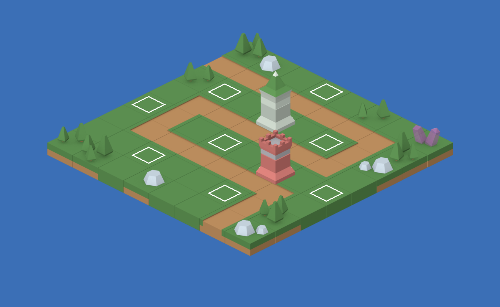
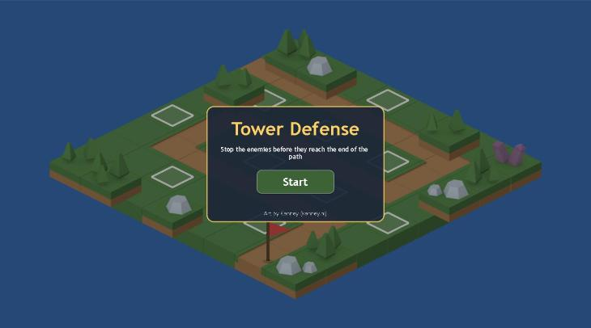
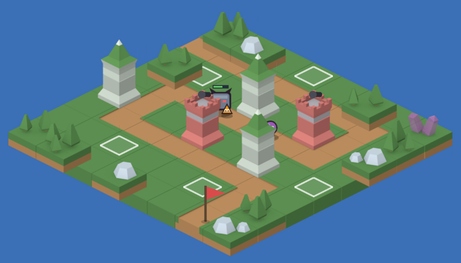
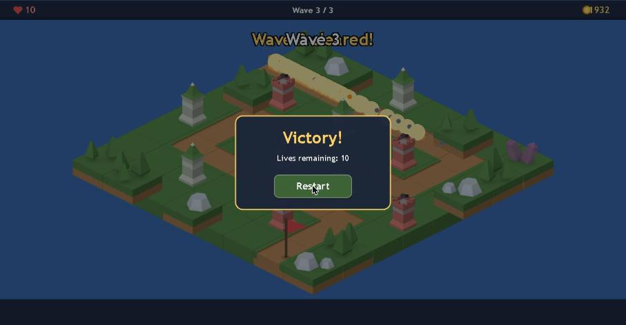
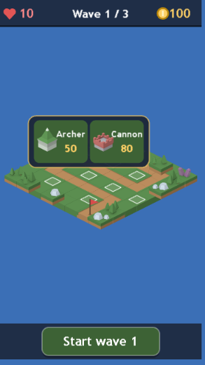

# Build Log — Tower Defense Project (Game Jam Entry)

| Date | Task | Branch / PR | ACs covered | Tests added | Reviewed by | Notes |
|---|---|---|---|---|---|---|
| 2026-10-04 | T-1 | `feature/T-1-scaffold` (no remote; no PR) | NFR-4, NFR-5, AC-10.4 (page CSS) | `tests/smoke.test.ts` | — | See T-1 notes |
| 2026-10-04 | T-2 | `feature/T-2-map` | AC-2.1, AC-2.3, AC-10.2 (spacing), DES-1 | `tests/map.test.ts` | — | See T-2 notes |
| 2026-10-04 | T-3 | `feature/T-3-iso-layout` | AC-2.2, AC-10.2, AC-10.3 (maths) | `tests/iso.test.ts`, `tests/layout.test.ts` | — | See T-3 notes |
| 2026-10-04 | T-4 | `feature/T-4-sim-core` | AC-1.3, 3.2, 3.3, 3.6–3.9, 5.1, 5.6, 5.8, 6.1–6.4, 8.1–8.5; BR-1–8, BR-10 | `tests/commands.test.ts`, `tests/step.test.ts`, `tests/purity.test.ts` | — | See T-4 notes |
| 2026-10-04 | T-5 | `feature/T-5-combat` | AC-4.1–4.4, 4.6, 4.7, 5.4 | `tests/combat.test.ts` | — | See T-5 notes |
| 2026-10-04 | T-6 | `feature/T-6-boot-title-map` | AC-1.1, 1.2, 1.4, 1.5, 2.1–2.5, 10.3 | `tests/palette.test.ts` + manual checklist | — | See T-6 notes |
| 2026-10-04 | T-7 | `feature/T-7-entities` | AC-4.1, 4.2 (visuals), 5.2, 5.3, 5.4 (effect), 10.5 (dt cap) | `tests/sync.test.ts` + manual check | — | See T-7 notes |
| 2026-10-04 | T-8 | `feature/T-8-ui` | AC-1.3, 3.1, 3.3–3.5, 3.7, 3.8, 6.1, 6.3, 6.5 (banner), 7.1–7.3, 8.1–8.4, 10.1, 10.2; NFR-7 | `tests/picker.test.ts`, `tests/hud.test.ts` + M1 playthrough | — | See T-8 notes |
| 2026-10-04 | T-9 | `feature/T-9-audio` | AC-1.6, 3.2 (sound), 4.5, 5.4 (sound), 5.6 (sound), 6.5 (sound), 9.1, 9.2, 9.4, 9.6, 10.5 (audio) | `tests/audio.test.ts` | — | See T-9 notes |
| 2026-10-04 | T-10 | `feature/T-10-music` | AC-9.3, 8.3 (music stop + jingle), 8.4 (music restart), 9.2 (victory/defeat) | `tests/music.test.ts` | — | See T-10 notes |
| 2026-10-04 | T-11 | `feature/T-11-balance` | AC-6.4, AC-6.6; NFR-1 (peak count) | `tests/balance.test.ts`, `tests/autoplay.ts` | — | See T-11 notes |
| 2026-10-04 | T-12 | `feature/T-12-device-pass` | NFR-1, 3, 7, 8; AC-2.2, 10.1–10.5 (real devices) | `tests/debug.test.ts` + device checklist | Pino (playtest) | Passed: "all looked good" |
| 2026-10-04 | T-13 | `feature/T-13-mute` | AC-9.5 (AC-5.2 Brute and AC-9.6 done earlier in T-7/T-9) | `tests/mute.test.ts` | — | See T-13 notes |

## T-1 notes
- **Stack:** Phaser 3.90.0 (pinned per ADR-001; npm `latest` is now Phaser 4.2.1, which we deliberately don't use), Vite 8.3.2, Vitest 5.0.3, TypeScript 5.9.3, zzfx 1.4.0.
- **Vite 8 / rolldown:** `rollupOptions.output.manualChunks` must be a function now. Chunk splitting was dropped since it isn't needed.
- **Build:** `npm run build` succeeds. `dist/` is 1.7 MB in total, JS 1.2 MB (320 KB gzip), so NFR-2 (≤ 5 MB) is met.
- **Manual check:** the dev server serves `index.html`, `/src/main.ts` and `/assets/landscape_sheet.xml` (200). `npm run dev` uses `--host`, so the iPhone can reach it over LAN.
- **Finding for T-9:** the `zzfx` package runs `new AudioContext` **when it is imported**. That would create a second context before the first tap (against ADR-003 and AC-9.4) and crash Vitest under Node. T-9 will vendor only ZzFX's `buildSamples` (MIT, with attribution) into `src/audio/` and drop the package import. This stays within ADR-003 (ZzFX for sound effects, pre-rendered buffers).
- **Assets:** copied `landscape_sheet`, `towers_grey_sheet` and `towers_red_sheet` (PNG + XML) and the Kenney licence into `public/assets/`.

## T-2 notes
- **Spike approach:** I picked frames using offline contact sheets of the atlases (Python/PIL) and a static mock render, not an in-game `?atlas=1` scene. That was faster, and nothing temporary has to be removed from the game later (T-16).
- **Path pieces** (by open sides; NW = c−1, SE = c+1, NE = r−1, SW = r+1): `landscape_32` straight along c, `landscape_29` straight along r, corners `31` (SE+SW), `39` (NW+NE), `34` (NE+SE), `35` (NW+SW). Grass: `landscape_13`.
- **Towers:** Archer = grey `tower_07` + `tower_01` + `tower_41` (green spire); Cannon = red `tower_50` + `tower_44` + `tower_24` (battlement; the barrel is drawn in code later). Piece rises are 30 px and 33 px; the base sits 45 px below the tile's top-face centre.
- **Bottom anchor** `top = y + 66 − h` checked on 99, 115 and 130 px frames in the mock. Scenery frames are full tiles that include grass.
- **Map:** 23-tile path (entry at the top-left edge, exit at the bottom); 10 spots; every spot pair is ≥ 2 tiles apart, and no spot pair is a same-sign knight move (those are only 119 world px apart).
- **Build-spot look (AC-2.3):** uses grass plus a code-drawn pulsing diamond outline. No distinct Kenney tile read clearly enough against grass or path; the outline alone is clear (see mock).
- **Mock:** 

## T-3 notes
- `src/sim/iso.ts`: projection `x = (c − r)·66`, `y = (c + r)·33`, its inverse, and `nearestSpot` (the nearest spot wins; any state).
- `src/render/layout.ts`: 48 px top HUD band, 64 px bottom band and 8 px padding. The map's world bounds (1056×600) are zoom-fitted into the rest and centred (letterboxed). It also provides `screenToWorld`/`worldToScreen`.
- **At 360×640:** zoom ≈ 0.326, tap radius 22 CSS px ≈ 67.5 world px. The closest spot pair (132 world px) gives each spot an exclusive radius of ≈ 21.5 CSS px, so DES-1's ≥ 20 px holds (tested).
- Viewports tested: 360×640, 640×360, 390×844, 1280×720 and 1920×1080.

## T-4 notes
- `src/config/balance.ts` holds every BR-10 number. The wave tables start from the design §3.6 retune proposal (15 / 26 / 38 enemies; gaps 2.0 / 1.5 / 1.3 s; 2 s pause before the 6 Brutes). T-11 finalises them under RD-5.
- `src/sim/state.ts` (types, `SimEvent`, `createRun`), `path.ts` (`pathPoint`, 23-tile path), `commands.ts` (`build`, `startWave`), `step.ts` (spawning, movement, leaks, wave end, defeat-before-victory, no-op after the run ends).
- The state is mutated in place, and commands leave it untouched when they refuse (tested with `structuredClone` before/after).
- `tests/purity.test.ts` enforces ADR-002: no Phaser or DOM imports under `src/sim` and `src/config`.

## T-5 notes
- Step order: spawn → move enemies (leaks) → towers fire → projectiles fly and hit → end check (defeat before victory).
- Range and splash use Euclidean distance on the ground grid, in tiles (design §3.6), not screen distance.
- Towers stay "ready" (cooldown 0) while no enemy is in range, so they fire as soon as one enters.
- Projectiles home in on the target's current position. When the target is gone: arrows vanish (AC-4.6), cannonballs finish their flight to the last seen position and splash there (AC-4.7).
- The `damage()` guard (`hp <= 0` → ignore) makes sure a reward is credited only once, even when an enemy is hit by a splash and an arrow in the same step.

## T-6 notes
- **Scenes:** `BootScene` (loading bar, then start `Game` and launch `Title` on top) → `GameScene` (map, camera fitted from `computeLayout` and re-fitted on resize) → `TitleScene` (dimmed overlay: title, goal line, Start button 200×60, Kenney credit; rebuilt on resize). Starting emits `title:start`, which T-8 and T-9 hook into.
- **Depth:** ground tiles at −1,000,000 + y; scenery tiles (trees, rocks, crystals) sort at their world y with other objects; spot markers sit above the ground and below objects. The flag and spot markers are tweened Graphics.
- **Load-error bug found and fixed:** a missing atlas PNG fails at Phaser's *processing* step, so `loaderror` never fires. That left the loading bar on screen forever. `create()` now also checks that every atlas texture exists.
- **Phaser banner:** it prints "Web Audio" even with `noAudio: true`. Its banner logic checks device support first, but `SoundManagerCreator` checks `noAudio` first, so no Phaser AudioContext is created. This is noted so the banner doesn't mislead anyone.
- **Dev-only handle:** `window.__game` exists in `import.meta.env.DEV` only, for manual checks.
- **Manual checklist (desktop Chrome, 1459×812 and 360×640 via a resized container):**
  - Loading bar shows, then the title: pass.
  - Renaming `towers_red_sheet.png` shows "Couldn't load the game — please refresh" and no Start button: pass.
  - The whole map is visible, centred and correctly sorted at 360×640 (letterboxed): pass.
  - Resize re-fits the camera and rebuilds the title without reloading: pass.
  - Real rotation on the iPhone is checked in T-12.
- **Screenshot:** 

## T-7 notes
- `GameScene` owns the `GameState`. It runs a fixed 60 Hz accumulator capped at 250 ms per frame (`render/sync.ts` `accumulate`), applies commands via `command()`, and re-emits every `SimEvent` on `game.events` (`sim:event`). Map taps emit `spot:tap` with the nearest *free* spot id, or null.
- `render/entities.ts` syncs towers (Container of stacked Kenney pieces plus a code-drawn cannon barrel, with a pop-in tween), enemies (cached code-drawn textures, shadow, walk bob, health bar once damaged) and projectiles (arrow line or cannonball; height interpolated from the tower top, cannonballs arc) by id.
- `render/effects.ts`: death puff and explosion. The explosion ellipse matches the 1-tile splash on the ground (radius × 66√2 by × 33√2).
- AC-8.3 freeze: `tweens.pauseAll()` on victory or defeat; `step()` is already a no-op once the run is over.
- Temporary dev keys (S start, A/C build on the last tapped spot, W start wave) live in DEV only and are removed in T-8.
- **Manual check (desktop Chrome):**
  - A scripted wave plays: enemies walk the path, towers fire, arrows and cannonballs fly, the explosion and health bars show, kills add gold (5 kills = +25).
  - Depth sorting is correct: a Grunt behind an Archer tower is partly hidden by it.
  - Grunt, Runner and Brute are clearly different in shape and size.
  - The background tab's requestAnimationFrame was throttled during automation, so frames were stepped through `GameScene.update` for the screenshots. This automation quirk doesn't affect real play.
  - **For T-12/T-14:** the Runner is small at phone zoom (≈ 9 px at 0.33). Consider scaling up enemies on small screens if it's hard to see on the iPhone.
- **Screenshot:** 

## T-8 notes
- `UIScene` (screen space, above `GameScene`):
  - Top HUD (heart and lives, "Wave N / 3", coin and gold) and bottom bar with "Start wave N" (build phase only).
  - Tower picker: placed above or below the spot and clamped on screen; options 100×76; dimmed when unaffordable, re-checked every frame; a tap on another spot moves it; a tap outside closes it; it closes on build and when the run ends.
  - "Wave N" and "Wave N cleared!" banners, and a Victory/Defeat overlay with Restart.
- `render/hud.ts` holds the pure helpers `placePicker`, `hudText`, `resultText` and `affordable` (tested).
- **Input ownership:** `GameScene` ignores a pointerup when `UIScene.isOverUi(x, y)` says it is on the bars, the picker or the result overlay. It also ignores any press that began before the current run started, so the tap on Start or Restart never also opens a picker underneath. This replaced the planned "consumed" flag, which depended on Phaser's cross-scene event order.
- Dev keyboard shortcuts were removed (grep confirms none are left).
- **Manual M1 playthrough (desktop Chrome, real clicks plus scripted fast-forward of waves):**
  - Start → HUD shows 10 / Wave 1 / 3 / 100: pass.
  - Tap a spot → picker above it; pick Cannon → tower built, gold 20: pass.
  - Tap another spot → picker with both options dimmed; tapping the dimmed Archer does nothing: pass.
  - Tap empty ground → picker closes: pass.
  - Start wave 1 → button hidden, kills add gold: pass.
  - Wave cleared → "Wave 1 cleared!", Wave 2 / 3, "Start wave 2": pass.
  - Lives reach 0 → Defeat, "Defeated on wave 2", battlefield frozen: pass.
  - Restart → lives 10, gold 100, wave 1, no towers, no picker, no overlay: pass.
  - 10 towers, all 3 waves → Victory, "Lives remaining: 10": pass.
  - 360×640 → HUD, picker and wave button fit; buttons ≥ 44 px: pass.
- **Observations for later tasks:**
  - **T-11:** one Cannon alone leaks 8 of 15 Grunts in wave 1. The strongest layout (10 towers, unlimited gold) needed only ~131 s of wave time, under 150 s, so retuning is needed as expected.
  - **Portrait phones:** the map is width-limited (zoom ≈ 0.33), so it looks small in portrait. Landscape is much bigger. Raised with Pino at the M1 demo.
  - Fast-forwarding through script leaves overlapping banners and frozen effects in screenshots. That's an artefact of stepping many seconds within one real frame, not normal play.
- **Screenshots:**  

## M1 demo decisions (Pino, 2026-10-04)
- Game title stays "Tower Defense".
- Portrait phones: leave as is (map width-limited, letterboxed); no rotate hint.

## T-9 notes
- **ZzFX port:** `src/audio/zzfxSynth.ts` ports ZzFX v1.4.0 `buildSamples` (MIT, licence header kept) and takes the sample rate as a parameter. The `zzfx` npm package was **removed**: importing it runs `new AudioContext` at load (see the T-1 finding).
- **Engine** (`src/audio/audio.ts`, singleton in `instance.ts`):
  - Graph: sources → sfx/music bus → master (mute) → speakers.
  - `unlock()` creates one context, sets `navigator.audioSession.type='playback'` where available (iOS 17+ ringer switch) and pre-renders every preset to an `AudioBuffer`. If anything throws, it goes `silent` (AC-1.6).
  - Playback adds ±5 % rate variety. At most 4 copies of one sound play at once (AC-9.6 was implemented here early, since it's a few lines; T-13 keeps only the mute toggle).
- **Wiring** (`src/audio/wire.ts`):
  - Native `pointerup`/`touchend` listeners on `document` call `unlock()`, which creates the context on the first tap and resumes it on every later tap. These native handlers count as user gestures on iOS no matter how Phaser schedules its own input.
  - Phaser `hidden`/`visible` suspend and resume the context.
  - `sim:event` events play their mapped sound.
- **Sounds (AC-9.2):** build, arrow, cannon, explode, death, lifeLost, waveStart. Victory and defeat jingles come in T-10.
- **Manual check (Chrome):**
  - No AudioContext before the first tap: pass.
  - After Start: context `running`, 48 kHz, 7 buffers prepared, a build plays a voice: pass.
  - Listening by ear is left to Pino at the M2 demo.

## T-10 notes
- **Sequencer** (`src/audio/music.ts`): a lookahead step sequencer (250 ms ahead, ticked every 50 ms).
  - Song: 4 bars of 8th notes at 132 BPM in A minor (Am–G–F–E). Square-wave lead, triangle-wave bass. It loops.
  - `stop()` cancels every note that hasn't started yet. `start()` always restarts from bar 1.
  - Jingles: victory C5–E5–G5–C6 (rising); defeat E4–D♯4–D4–A3 (falling).
  - The scheduler is injectable (`NoteScheduler`), so tests run on a fake clock; `webAudioScheduler` plays through the engine's music bus.
- **Wiring:** music starts on `run:started` (Start and Restart). On `victory`/`defeat` it stops and plays the jingle. The music object is created the first time the AudioContext exists, and stays absent when audio is silent.
- **Manual check (Chrome; oscillator creation counted with a patched `createOscillator`):**
  - After Start: 23 notes in ~3 s, square lead (440/523/659 Hz) plus triangle bass (110 Hz): pass.
  - Forced defeat: jingle 330 → 311 → 294 → 220 Hz, then no new music notes for 1.5 s: pass.
  - Restart: music restarts from bar 1 (first lead 440 Hz): pass.
- **Observation:** the first click after a fresh navigation didn't register in the automated browser, and the second did. This looked like the automation tab gaining focus; watch for it on the iPhone in T-12.

## T-11 notes — balance (RD-5: tuned without re-approval; AC-6.4 and AC-6.6 hold)
- **Harness** (`tests/autoplay.ts`): headless scripted players that press each "Start wave" 5 s after it appears.
  - Four aggressive strategies (archers only, cannon first, three archers then cannons, alternating) spend all gold at once on the spots that cover the most path.
  - "Barely winning" finds the fewest Archers, bought between waves, that still win.
- **Problems found in the starting numbers:**
  - (1) The Cannon was a trap: 12.5 DPS for 80 gold against the Archer's 15 for 50, and splash rarely hits single-file enemies. "Cannon first" lost wave 1.
  - (2) Far too easy: 2 Archers won the whole game with 6 lives left.
  - Timing was already inside the window.
- **Final BR-10 changes:**

| Value | Before | After |
|---|---|---|
| Starting gold (BR-1) | 100 | **150** |
| Cannon damage / fire rate | 25 / 0.5 per s | **40 / 0.6 per s** |
| Grunt health / reward | 40 / 5 | **104 / 6** |
| Runner health / reward | 25 / 6 | **65 / 7** |
| Brute health / reward | 160 / 15 | **416 / 20** |
| Waves, speeds, Archer, costs, bonuses | design §3.6 proposal | unchanged |

- **Results** (`tests/balance.test.ts` asserts all of these):

| Player | Outcome | Run time | Lives left | Towers | Wave times (s) | Peak enemies |
|---|---|---|---|---|---|---|
| archersOnly | victory | 191 s | 10 | 10 | 45 / 44 / 87 | 8 |
| cannonFirst | victory | 191 s | 10 | 10 | 51 / 45 / 81 | 10 |
| threeArchersThenCannons | victory | 175 s | 10 | 10 | 50 / 43 / 67 | 8 |
| alternating | victory | 169 s | 10 | 10 | 43 / 43 / 68 | 8 |
| barely winning (4 Archers) | victory | 213 s | 2 | 4 | 50 / 51 / 96 | 12 |

- **What this means:**
  - Every winning run takes 169–213 s, inside AC-6.6's 150–240 s.
  - 1–3 towers lose, so the game isn't trivial.
  - Any opening is viable.
  - At most 12 enemies are on screen at once, far below NFR-1's 26 and the test's cap of 30.
- **Caveat:** aggressive players finish with all 10 lives. A real player who builds more slowly will feel more pressure. Pino's playtest in T-12 is the real check on difficulty; the numbers can be retuned under RD-5 and the test keeps the timing honest.
- `tests/combat.test.ts` "Grunt dies after N hits" now derives N from the balance values instead of hard-coding 4.

## T-12 — device pass (in progress; Pino plays on real devices)
- Added the design §6 debug overlay: `?debug=1` shows "N fps · M enemies" above the bottom bar (`src/render/debug.ts`, `tests/debug.test.ts`).
- Desktop URL: http://localhost:5173/?debug=1. iPhone over Wi-Fi: http://192.168.1.114:5173/?debug=1 (dev server answers 200 on the LAN address).
- Production build OK: `dist/` is 1.8 MB.

### Device checklist (fill in: ✅ / ❌ + note)
| # | Check | Desktop Chrome | iPhone Safari |
|---|---|---|---|
| 1 | Title → Start; music starts on the Start tap (AC-9.3, 9.4) | | |
| 2 | Tapping build spots opens the picker on the right spot; no mis-taps (AC-10.2) | | |
| 3 | No page scroll, pinch zoom, double-tap zoom or text selection (AC-10.4) | — | |
| 4 | Sound effects audible and not annoying; music OK (AC-9.2) | | |
| 5 | Ringer switch on silent: does sound still play? (iOS 17+ expected yes) | — | |
| 6 | Lock the phone / switch apps mid-wave, come back: game paused, no jump, sound returns after a tap (AC-10.5) | | |
| 7 | Rotate portrait ↔ landscape mid-run: re-fits within ~0.5 s, run continues (AC-10.3) | — | |
| 8 | FPS at the wave 3 peak, with `?debug=1` (NFR-1: ≥ 55 desktop / ≥ 30 iPhone) | | |
| 9 | Full Victory run, then Restart (AC-8.2, 8.4) | | |
| 10 | A Defeat run, then Restart (AC-8.1, 8.4) | | |
| 11 | Difficulty feels right? (T-11 caveat) | | |
| 12 | Console errors? (desktop DevTools; Safari Web Inspector if available) (NFR-8) | | |

### T-12 result
- Pino played on desktop Chrome and iPhone Safari and reported "all looked good". All checklist items passed, with no issues raised.
- No individual measurements (e.g. exact FPS figures) were recorded. The pass is recorded as Pino's overall sign-off.
- One mid-test report of "no music" turned out to be the wrong audio output device on Pino's side, not a defect.

## T-13 notes
- Brute visuals (AC-5.2) were already built in T-7, and the 4-copy sound limit (AC-9.6) in T-9. This task added only the **mute toggle** (AC-9.5).
- The toggle is a 48×48 speaker button at the right end of the bottom bar (`muteButtonRect`, tested to sit inside the bar and clear of "Start wave" at 360 px). It shows a red slash when muted.
- The setting lives in the audio engine singleton, so Restart (a new `GameState`) keeps it. Tab hide/show doesn't change it either (T-9 test).
- **Manual check (Chrome):**
  - Clicking the button sets `muted = true` and master gain 0, and shows the red slash: pass.
  - The tap didn't open a picker underneath: pass.
- **Automation note:** the first click after a fresh navigation sometimes doesn't register in the automation tab, and the tab sometimes stops repainting until a frame is forced through `game.step`. Both are browser-automation quirks; Pino's real-device pass had no such issue.
